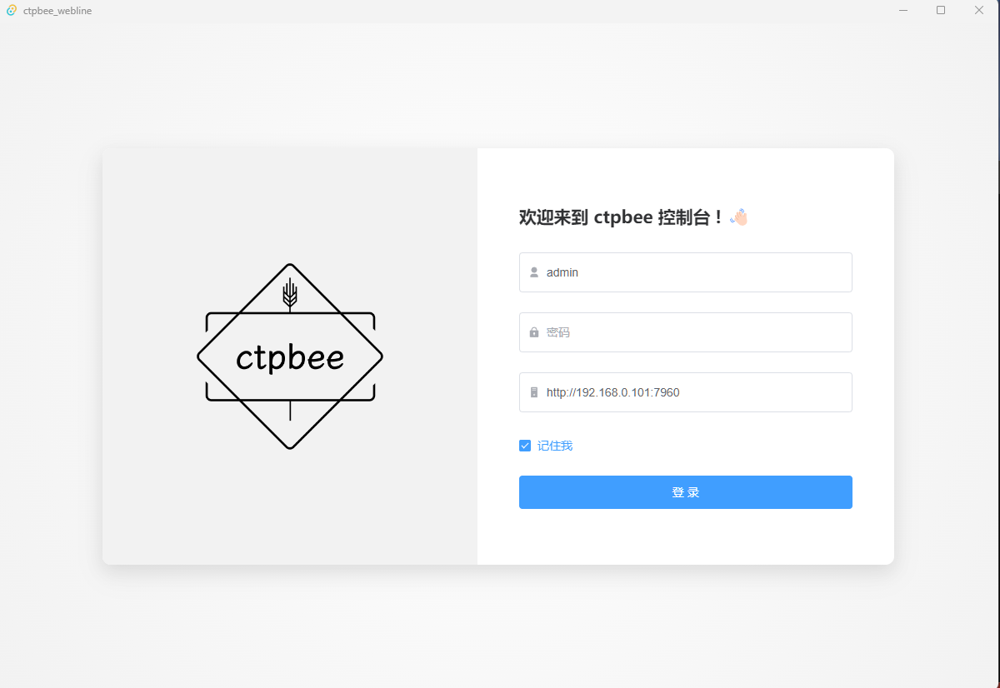
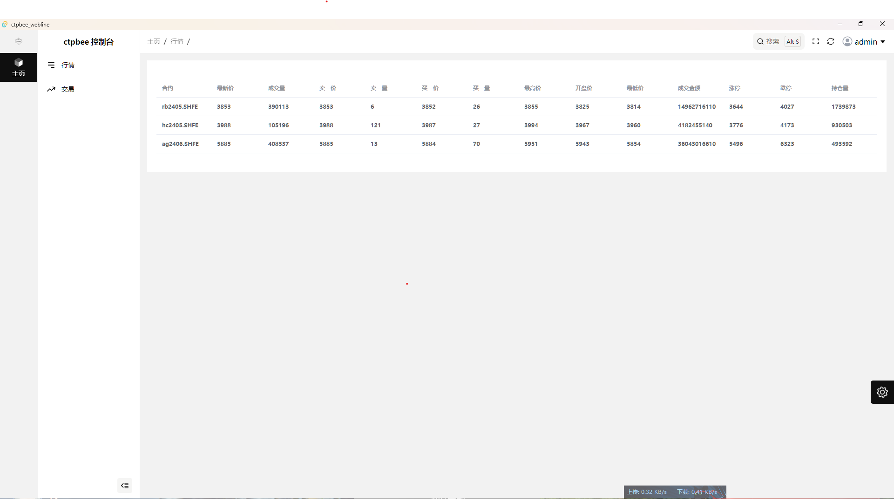

# webline

ctpbee提供的界面版本后端实现

前端项目托管于[ctpbee_webline-vue](https://github.com/ctpbee/webline-vue)

### 快速安装

```bash 
# 等待实现
pip3 install ctpbee_webline
```

### 界面效果




### 下载地址

暂未完成 0.0

### 初始化

在你的项目目录文件下面使用以下命令

```bash
ctpbee_webline initdb
```

此命令会创建默认用户`admin`以及密码`123456`

然后运行你的`ctpbee`的`app`即可

### 待实现功能

- [x] 登录功能
- [ ] 下单功能
- [ ] 行情查看功能
- [ ] 设置预埋单功能
- [ ] 策略停止开关功能
- [ ] 历史订单功能 盈亏分析功能
- [ ] 对接hive API功能<历史数据查看>

使用`python3.6+` & `vue3.0`技术实现

> powerd by hfqr 